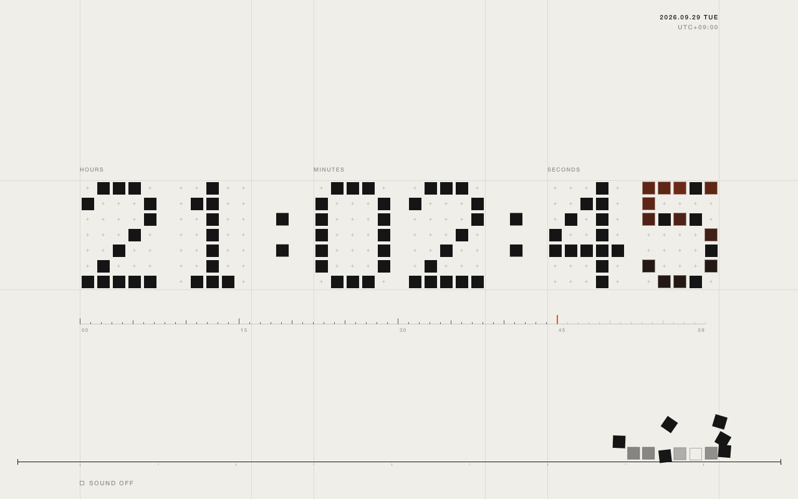

# Kinetic Clock New Tab

A Chrome extension that replaces the new tab page with a live clock made of small square tiles.

Every second, tiles spring into place to form the next digit and land exactly on the beat. Every ten seconds a wave passes through the numbers, and every minute the digits flip. Drag across the clock to push the tiles; they settle back on their own.



- Manifest V3, no permissions, no network requests
- Plain Canvas 2D and vanilla JavaScript, no build step
- Optional tick sound (off by default)
- Respects `prefers-reduced-motion`

## Install from source

1. Open `chrome://extensions` and turn on Developer mode.
2. Click "Load unpacked" and choose the `extension/` folder.
3. Open a new tab.

## Package for the Chrome Web Store

```sh
cd extension && zip -rqX ../kinetic-clock-newtab.zip manifest.json newtab.html newtab.js icons
```

Store listing text and graphics are in [`store/`](store/).

---

新しいタブを、小さな正方形のタイルで組み上がる時計に置き換える Chrome 拡張機能です。権限・外部通信なし。
