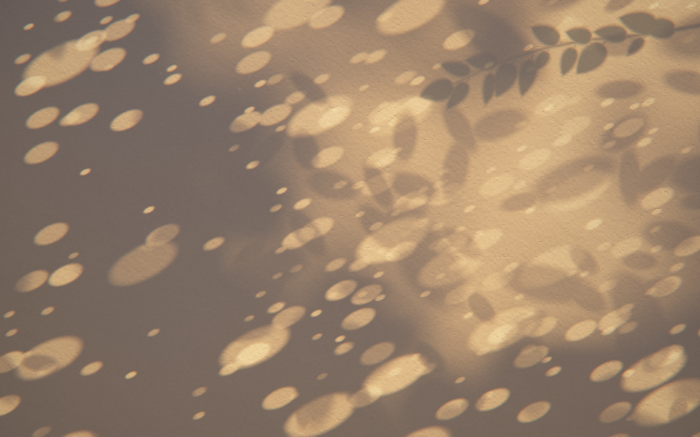

# clock-work

Clocks for the Chrome new tab page. Each folder is a separate Manifest V3 extension with no permissions and no network requests.

| Clock | What it is |
|---|---|
| [kinetic/](kinetic/) | Kinetic Clock: the time assembled from small sprung tiles that land exactly on the second. |
| [komorebi/](komorebi/) | Komorebi Clock: a clock without numerals. Sunlight through leaves on a wall; the pool of light moves with the hour like a sundial. |

---

Chrome の新しいタブ用の時計を集めたリポジトリです。
